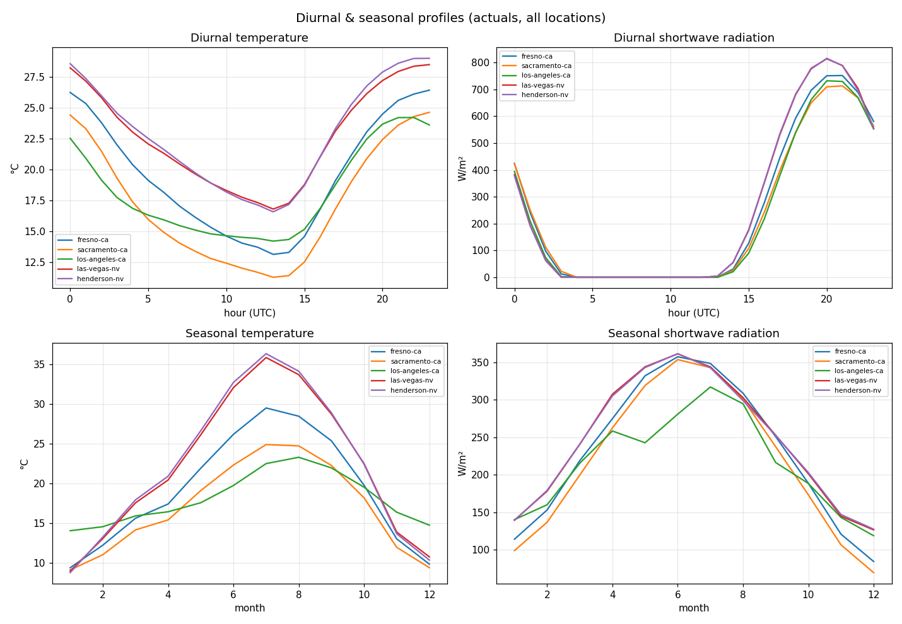
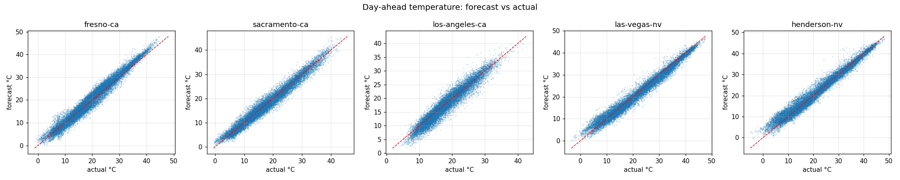

# Initial EDA — weather-capture history

Generated by `modeling/EDA/eda.py`. Sources: verification actuals, 
previous_runs (ECMWF IFS HRES day-ahead), ensemble_mean archive (3 models).

## 1. Coverage & completeness

| location | actuals hours | range | prev_runs valid% | ens_mean hours |
|---|---|---|---|---|
| fresno-ca | 28392 | 2023-05-01 → 2026-07-26 | 96.4% | 2376 |
| sacramento-ca | 28392 | 2023-05-01 → 2026-07-26 | 96.4% | 2376 |
| los-angeles-ca | 28392 | 2023-05-01 → 2026-07-26 | 96.4% | 2376 |
| las-vegas-nv | 28392 | 2023-05-01 → 2026-07-26 | 96.4% | 2376 |
| henderson-nv | 28392 | 2023-05-01 → 2026-07-26 | 96.4% | 2376 |

_previous_runs is null before 2024-02-04 (Jan 2024 empty), 100% populated after. The usable modeling window with a day-ahead feature is **2024-02-04 → today**._

## 2. Actuals — summary statistics

### temperature_2m (°C)

| location | mean | std | min | p50 | max |
|---|---|---|---|---|---|
| fresno-ca | 19.6 | 9.1 | -1.2 | 18.8 | 44.8 |
| sacramento-ca | 17.3 | 8.2 | -1.3 | 15.9 | 43.7 |
| los-angeles-ca | 18.2 | 5.5 | 4.2 | 17.5 | 42.6 |
| las-vegas-nv | 22.7 | 10.6 | -3.4 | 22.8 | 47.5 |
| henderson-nv | 22.9 | 10.9 | -5.0 | 23.0 | 48.1 |

### shortwave_radiation (W/m²)

| location | mean | std | min | p50 | max |
|---|---|---|---|---|---|
| fresno-ca | 238.2 | 323.0 | 0.0 | 0.0 | 1052.0 |
| sacramento-ca | 226.0 | 313.5 | 0.0 | 0.0 | 1042.0 |
| los-angeles-ca | 219.6 | 306.2 | 0.0 | 0.0 | 1050.0 |
| las-vegas-nv | 253.2 | 334.2 | 0.0 | 0.0 | 1088.0 |
| henderson-nv | 252.9 | 333.7 | 0.0 | 0.0 | 1094.0 |

### cloud_cover (%)

| location | mean | std | min | p50 | max |
|---|---|---|---|---|---|
| fresno-ca | 24.1 | 38.2 | 0.0 | 0.0 | 100.0 |
| sacramento-ca | 31.8 | 40.7 | 0.0 | 6.0 | 100.0 |
| los-angeles-ca | 42.1 | 42.1 | 0.0 | 22.0 | 100.0 |
| las-vegas-nv | 18.8 | 34.4 | 0.0 | 0.0 | 100.0 |
| henderson-nv | 18.4 | 33.9 | 0.0 | 0.0 | 100.0 |

### wind_speed_100m (km/h)

| location | mean | std | min | p50 | max |
|---|---|---|---|---|---|
| fresno-ca | 12.9 | 8.9 | 0.0 | 10.9 | 60.9 |
| sacramento-ca | 16.9 | 10.8 | 0.0 | 15.1 | 89.5 |
| los-angeles-ca | 10.0 | 6.4 | 0.0 | 8.4 | 70.8 |
| las-vegas-nv | 12.3 | 10.8 | 0.0 | 8.9 | 87.1 |
| henderson-nv | 15.9 | 13.6 | 0.0 | 11.1 | 92.2 |

## 3. Diurnal & seasonal profiles

Times are UTC; California/Nevada local is UTC−7/−8, so the temperature trough near hour 13 UTC and solar peak near hour 20 UTC are the expected pre-dawn low and local solar noon.

## 4. Day-ahead forecast skill (previous_runs vs actuals)

Aligning the ECMWF IFS HRES day-ahead feature against actuals on the shared timestamps (2024-02-04 onward). Error = forecast − actual.

| location | var | n | bias | MAE | RMSE | corr |
|---|---|---|---|---|---|---|
| fresno-ca | temperature_2m | 21696 | +0.51 | 1.52 | 1.89 | 0.984 |
| fresno-ca | shortwave_radiation | 20935 | -8.66 | 25.89 | 54.40 | 0.987 |
| fresno-ca | cloud_cover | 21696 | -3.08 | 16.83 | 30.97 | 0.633 |
| fresno-ca | wind_speed_100m | 20934 | +0.46 | 4.00 | 5.31 | 0.820 |

| sacramento-ca | temperature_2m | 21696 | -0.12 | 1.20 | 1.55 | 0.982 |
| sacramento-ca | shortwave_radiation | 20935 | -5.03 | 23.89 | 54.27 | 0.986 |
| sacramento-ca | cloud_cover | 21696 | -3.95 | 17.83 | 30.57 | 0.697 |
| sacramento-ca | wind_speed_100m | 20934 | -1.45 | 4.46 | 5.76 | 0.855 |

| los-angeles-ca | temperature_2m | 21696 | -0.32 | 1.30 | 1.70 | 0.961 |
| los-angeles-ca | shortwave_radiation | 20935 | +12.71 | 35.08 | 81.65 | 0.967 |
| los-angeles-ca | cloud_cover | 21696 | -22.57 | 30.90 | 45.77 | 0.431 |
| los-angeles-ca | wind_speed_100m | 20934 | +0.06 | 3.59 | 4.91 | 0.708 |

| las-vegas-nv | temperature_2m | 21696 | -0.32 | 1.31 | 1.74 | 0.987 |
| las-vegas-nv | shortwave_radiation | 20935 | -9.77 | 22.91 | 50.22 | 0.990 |
| las-vegas-nv | cloud_cover | 21696 | -2.66 | 16.06 | 30.66 | 0.524 |
| las-vegas-nv | wind_speed_100m | 20934 | +0.24 | 4.68 | 6.67 | 0.801 |

| henderson-nv | temperature_2m | 21696 | +0.31 | 1.36 | 1.87 | 0.986 |
| henderson-nv | shortwave_radiation | 20935 | -12.71 | 26.16 | 54.80 | 0.989 |
| henderson-nv | cloud_cover | 21696 | -2.11 | 15.46 | 29.65 | 0.547 |
| henderson-nv | wind_speed_100m | 20934 | -0.46 | 5.74 | 7.95 | 0.818 |

## 5. Ensemble mean/spread (archive)

Mean spread by model & variable over the ~93-day archive window (Fresno). Spread is the ensemble's own uncertainty estimate.

| model | temp spread | solar spread | cloud spread | wind spread |
|---|---|---|---|---|
| dwd_icon_eps | 0.65 | 7.66 | 8.94 | — |
| ncep_gefs025 | 0.59 | 8.04 | 7.11 | — |
| ecmwf_ifs025 | 0.49 | 7.74 | 6.51 | 1.94 |

_**Data-availability finding:** `wind_speed_100m` (and its spread) is entirely null for DWD ICON and GFS in the ensemble_mean archive — only ECMWF IFS provides 100 m wind here. The other three variables are present for all three models. Anything using ensemble 100 m wind as a feature must rely on ECMWF, or fall back to a lower level._

## 6. CSV exports

Analysis-ready CSVs written to `modeling/EDA/csv/`:

- `actuals_hourly.csv` — long table: time, location, 4 actual variables.
- `temp_forecast_vs_actual.csv` — aligned day-ahead temp forecast, actual, and error per timestamp/location.

