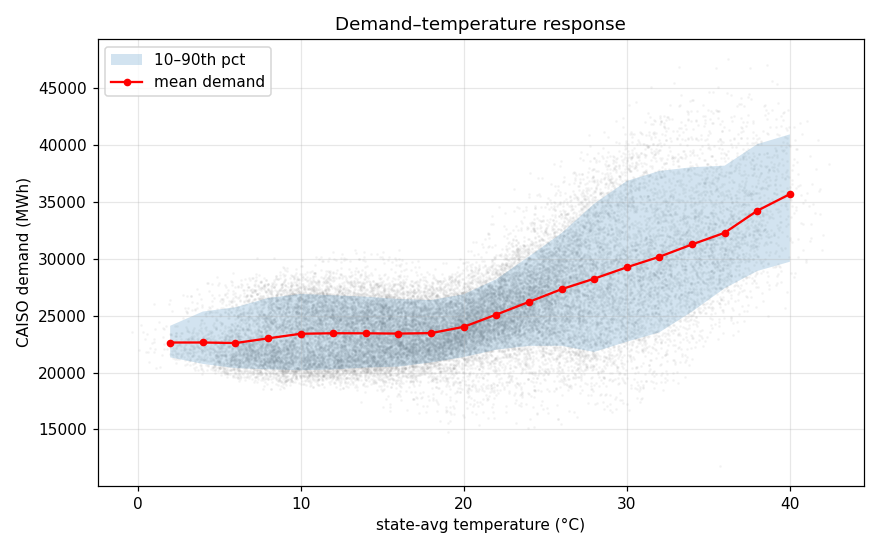
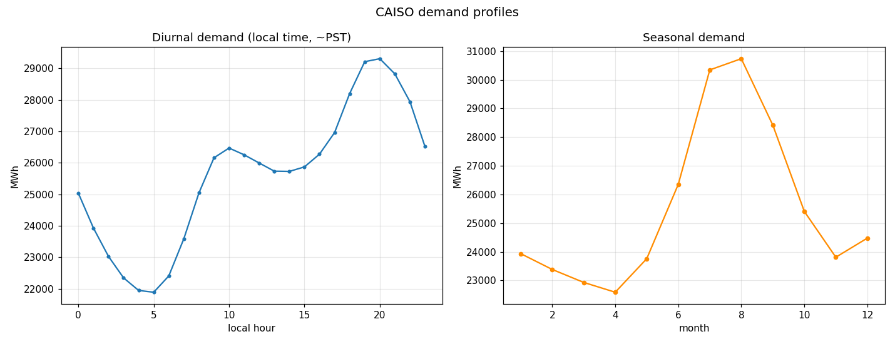

# Demand vs weather — first join

Generated by `modeling/EDA/join_demand_weather.py`. CAISO system demand (EIA) joined to actuals weather on UTC hours.

Aligned hours (demand + full 5-city weather): **28384** (2023-05-01T00:00 → 2026-07-26T17:00).

## 1. Demand–temperature response curve

Minimum-demand temperature ≈ **6 °C** (22598 MWh). Demand rises on both sides — the classic U-shape from heating below and cooling (AC) above.

Cooling-side sensitivity ≈ **398 MWh per °C** above the minimum — the AC-driven limb, which is where summer forecast error costs the most.

## 2. Diurnal & seasonal demand profiles

Demand peaks around **20:00 local** (29306 MWh) and troughs near **05:00** (21888 MWh) — the evening AC+lighting ramp vs pre-dawn low. Seasonally, the summer cooling peak (month 8) dominates.

## 3. Weather–demand correlation (state-avg, whole series)

| variable | corr with demand |
|---|---|
| temperature_2m | +0.623 |
| shortwave_radiation | +0.133 |
| cloud_cover | -0.230 |
| wind_speed_100m | +0.151 |

_Raw hourly correlation mixes the diurnal cycle of both signals; the response curve in §1 is the cleaner read on the physical relationship. Temperature's signal is U-shaped, so a linear correlation understates it — cooling-degree / heating-degree features will matter in modeling._

## 4. Degree-day features (base = response minimum)

Using base **6 °C**: cooling-degrees corr with demand **+0.625**, heating-degrees **-0.086**. Cooling dominates in this CA/NV footprint, as expected — the AC load is the big weather-driven swing. These degree-day transforms are the natural first features.

