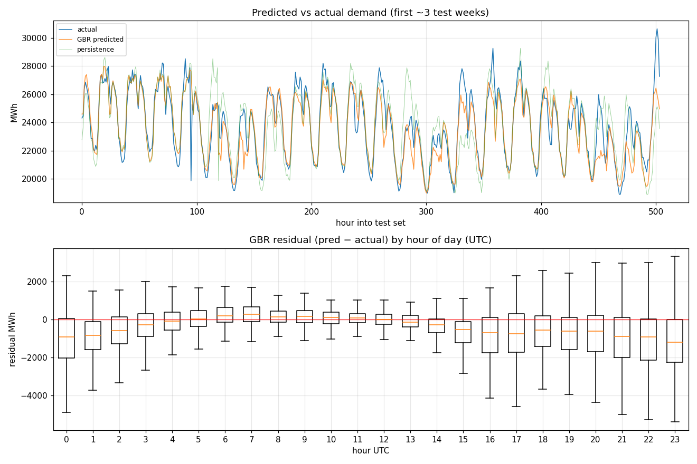

# Baseline demand model

Predict CAISO hourly demand from a **day-ahead** weather forecast + calendar + lagged demand. Temperature feature is `previous_runs` (as-issued day-ahead), never actuals — see the firewall note in `history/README.md`.

Usable rows (feature + label + lag24 + lag168): **21690** (2024-02-04T00:00 → 2026-07-26T17:00).

Train: 17352 rows (2024-02-04 → 2026-01-26). Test: 4338 rows (2026-01-27 → 2026-07-26).

## Results (test set = final 20%, time-ordered)

| model | MAE (MWh) | RMSE (MWh) | MAPE | R² |
|---|---|---|---|---|
| persistence (lag-24) | 1,347 | 1,889 | 5.16% | 0.7940 |
| climatology (hour×month) | 2,256 | 3,049 | 8.27% | 0.4636 |
| linear regression | 1,074 | 1,433 | 4.12% | 0.8815 |
| gradient boosting | 890 | 1,277 | 3.32% | 0.9059 |

Gradient boosting MAE **890 MWh** — a **34%** cut vs persistence (1,347). On a mean demand of 25,837 MWh that is ~3.4% error.

**Weather ablation:** dropping the day-ahead temperature features raises MAE to **927 MWh** (from 890). The day-ahead forecast buys a **3.9%** MAE reduction on top of demand autocorrelation — modest but real, and it validates the premise that day-ahead weather improves a demand forecast.

## Feature importance (permutation, MAE drop)

| feature | importance |
|---|---|
| dem_lag24 | 1,591 |
| temp_da | 702 |
| hour_sin | 318 |
| dow_sin | 228 |
| dem_lag168 | 186 |
| dow_cos | 140 |
| hour_cos | 70 |
| month_cos | 20 |
| is_weekend | 12 |
| heat_deg | 1 |
| cool_deg | 0 |
| month_sin | -9 |

## Notes & honest caveats

- **Firewall respected**: temperature is the day-ahead `previous_runs` forecast; demand lags are ≥24h old. No target-hour leakage.

- Test period is the most recent ~20% (a single contiguous block incl. summer). A rolling/backtested split would give a sturdier estimate.

- `dem_lag24`/`dem_lag168` carry most of the signal (demand is highly autocorrelated); weather degree-days add the temperature-driven swing on top. That split is visible in the importance table.

- Next: per-horizon evaluation, holiday calendar, and swapping the point forecast for the ensemble mean/spread to get uncertainty.

